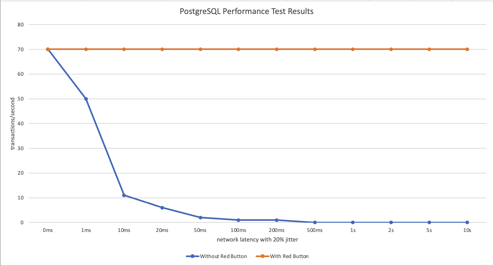
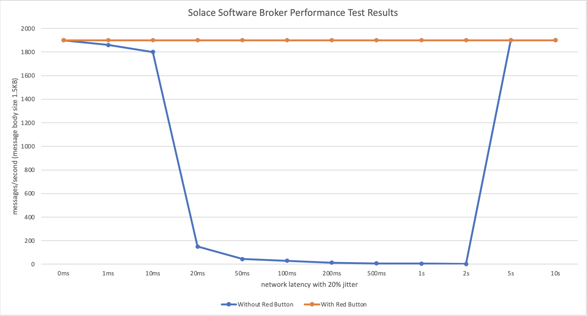
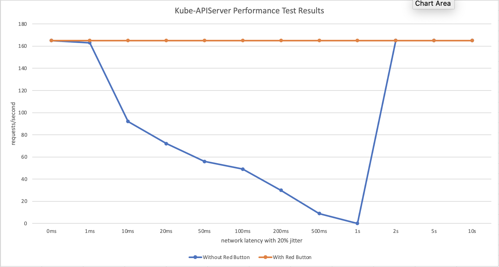

# Test Summary

## Overall Summary

In conclusion, from the tests we learnt that zonal partial outages could cause severe performance issues to some services. A forced and controlled Global Failover could mitigate the issues quickly. To be more specific about "control", in addition to cordoning the nodes in the unhealthy zone and evicting the pods in it, some services might need to carry out extra operations before we apply network isolation. This is where a webhook / callback, prepared by corresponding service team, kicks in that we could call before starting our workflow during a Global Failover.

## Performance Test Result Chart

### PostgreSQL Performance Test Result

### Solace Software Broker Performance Test Result

*NOTE: for SSB failover scenarios, the failbacks might fail if the active instance has not released the AD-Lock. In order to guarantee a successful failover, some manual steps are needed for the graceful shutdown of the unhealthy instance. Please refer to [this document](https://docs.solace.com/Features/DR-Replication/Perf-Con-Fail-Over.htm) for more details about the manual steps.*

### Kube-APIServer Performance Test Result

*Note: for kube-apiserver failover scenarios, when network latency reached two seconds, ETCD cluster failover happened.*

## Test Summaries Per Application

### Message Queueing Service Backed by Solace

When there is partial outage, the performance of the Solace Software Brokers (SSB) provided by MQ Service will be severely affected. Though Solace makes sure no message is lost, it is very likely that the durable Queue is full because subscribers are not able to consume the messages. Thus making the publishers fail to send out any new message.

As observed from our tests with network latency and packet loss, only latency over 2 seconds or packet loss over 60% will trigger automatic failover of the SSB.

A forced Global Failover could quickly mitigate the performance issue. But as proved by our various tests:
- Directly adding network ACL to SSB instances could possibly make failover to fail in many occasions.
- By cordoning the node of the active instance and evicting its pod before adding network ACL, in some cases, e.g. under constant stable network latency, the unhealthy instance could be gracefully shutdown and the failover succeeds. However, when there is network packet loss or network latency with jitter, failover could fail.

Solace support has responded to us that, in order for SSB to successfully fail over, the AD-Lock on active instance must be released, which means a graceful shutdown of the active instance is needed. Solace official documentation provides a [guide](https://docs.solace.com/Features/DR-Replication/Perf-Con-Fail-Over.htm) for controlled failover in Disaster Recovery scenario. They doesn't have one for HA scenario, but the process might be similar.

In a nutshell, for Solace Software Brokers, manual steps are needed in order for a controlled failover to happen before we apply network isolation.

### CrunchyData PostgreSQL

When PostgreSQL cluster is set to default / asynchronous mode, network interruptions will only affect the performance of the cluster when they happen on the active instance. However, if PostgreSQL cluster is set to synchronous mode, network interruptions will affect the performance of the cluster no matter they happen on the active or the stand-by instance.

With one millisecond network latency, we could see obvious performance downgrade. With ten milliseconds network latency, the performance becomes around one-fourth of the original. With over two hundred milliseconds network latency, the cluster is almost not usable because almost no database operations can be successfully submitted.

As for failover scenarios, with CrunchyData PostgreSQL cluster HA setup, no automatic failover will happen. This means the performance downgrade, no matter how severe it is, will persist until the infrastructure zonal partial outage is gone. In addition, if the HA cluster is setup in synchronous mode, even if the active node is not affected, the performance of the service will be affected nonetheless.

A controlled forced failover, by cordoning unhealthy nodes, evicting unhealthy pods, and isolating unhealthy zone via network ACL, can mitigate the issue.

### Kube-APIServer with ETCD Cluster

#### ETCD

For ETCD cluster, when partial outage happens in the zone where the ETCD leader is, the performance of the whole service will be affected. When partial outage happens in the zone where the ETCD follower is, only the user (e.g., kube-apiserver) that connects to this unhealthy follower will be affected (the write operations to the ETCD follower will be forwarded to the ETCD leader). With default configurations, disk IO latency as well as network latency greater than one second will cause ETCD cluster to fail over.

In general there are two ways to connect to an ETCD cluster. The impact on the performance of the applications that use ETCD is different for each method.

- Connect via ClusterIP
  
  In default mode, kube-proxy maintains the iptable on the node. All the ETCD instance destinations are maintained in the iptable chain. So when an application tries to establish a new TCP connection to the ETCD cluster, one of the instance will be chosen (randomly or in a round-robin way), including the unhealthy one. For those that connect to the unhealthy instance, the performance downgrade will persist until they switch to connect to another instance.

- Connect via Pod fully qualified domain name endpoints

  Application that connects to ETCD cluster via Pod's FQDN endpoints will establish a TCP connection for each endpoint. And depending on which load balancer it is using, the impact would be slightly different. For example, if there are three ETCD instances one of whom is unhealthy, and the application uses round-robin load balancer, one third of the requests will be sent to the unhealthy instance

#### Kube-APIServer

The connection established between kube-apiserver and ETCD is kept-alive. By default, every thirty seconds a heartbeat will be sent. Timeout for the heartbeat is by default ten seconds. If the heartbeat server does not reply in ten seconds, the TCP connection will be dropped and a new one will be established.

Usually, we will configure liveness probe and readiness probe for the kube-apiserver. By default, if the kube-apiserver could not get a response from the ETCD cluster in two seconds, a health check would fail. After several consequential unsuccessful health check, the Pod will be restarted. However, the restarted Pod could still connect to the unhealthy ETCD instance. Even worse, since kube-apiserver establishes one TCP connection to ETCD cluster for each of its API resources, there might be over a hundred connections, a lot of them could be established with the unhealthy instance. Moreover, the health check service uses different connection from the API resources, which means the health check might pass when the issue still affect the performance of the kube-apiserver as a whole.

#### Summary

All in all, for kube-apiserver with ETCD cluster, it is possible for the HA setup to survive a partial zonal outage without human interventions. However, as shown by our tests, when the outage was not severe enough (in our tests with network latencies, even 5-second latency could not trigger auto-heal of kube-apiserver because the 10-second keep-alive timeout was not reached), the performance was still greatly influenced. In this case, Global Failover may still be useful. If we isolate the unhealthy ETCD instance, the kube-apiserver will no longer establish connection to it, and all the ETCD clients will be talking to the healthy servers, thus mitigating the performance issue.
